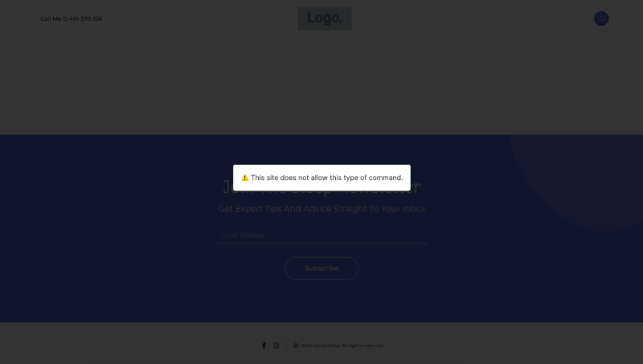
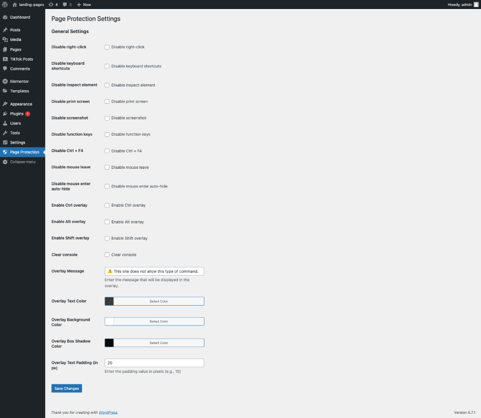

# Page Protection Plugin

## Description

### English (UK)

The **Page Protection Plugin** helps you create a customizable overlay on your website. You can display a message with a darkened background to prevent users from performing certain actions, such as copying content or executing restricted commands. This plugin allows you to adjust the **background colour**, **padding**, and **text shadow** of the overlay message directly from the WordPress admin panel.

### Português (Portugal)

O **Plugin de Proteção de Página** permite-lhe criar uma sobreposição personalizável no seu website. Pode exibir uma mensagem com um fundo escurecido para impedir que os utilizadores realizem certas ações, como copiar conteúdo ou executar comandos restritos. Este plugin permite ajustar a **cor do fundo**, **padding** e **sombra do texto** da mensagem de sobreposição diretamente do painel de administração do WordPress.

## Features

### English (UK)

- Customisable overlay message.
- Adjustable background colour, padding, and text shadow for the overlay message.
- Easy configuration through the WordPress admin panel.
- Lightweight and simple to use.
- Provides an intuitive user interface for easy configuration.

### Português (Portugal)

- Mensagem de sobreposição personalizável.
- Ajuste da cor do fundo, padding e sombra do texto para a mensagem de sobreposição.
- Configuração fácil através do painel de administração do WordPress.
- Leve e simples de utilizar.
- Interface de utilizador intuitiva para uma configuração fácil.

## Installation

### English (UK)

1. Download the plugin `.zip` file.
2. Go to the WordPress admin panel, navigate to **Plugins** > **Add New**.
3. Click on **Upload Plugin** and choose the downloaded `.zip` file.
4. Click **Install Now** and then **Activate**.
5. Go to **Settings** > **Page Protection** to configure the plugin settings.

### Português (Portugal)

1. Descarregue o ficheiro `.zip` do plugin.
2. Aceda ao painel de administração do WordPress, e vá até **Plugins** > **Adicionar Novo**.
3. Clique em **Carregar Plugin** e seleccione o ficheiro `.zip` descarregado.
4. Clique em **Instalar Agora** e depois em **Ativar**.
5. Aceda a **Configurações** > **Proteção de Página** para configurar as definições do plugin.

## Configuration

### English (UK)

After activation, you can configure the plugin settings via the **Settings** > **Page Protection** menu in the WordPress admin panel. Here you can:

- Edit the overlay message.
- Select a background colour for the overlay message.
- Set the padding around the message.
- Apply a text shadow to the message.

### Português (Portugal)

Após a ativação, pode configurar as definições do plugin através do menu **Configurações** > **Proteção de Página** no painel de administração do WordPress. Aqui pode:

- Editar a mensagem de sobreposição.
- Seleccionar uma cor de fundo para a mensagem de sobreposição.
- Definir o padding à volta da mensagem.
- Aplicar uma sombra ao texto da mensagem.

## Screenshots

### English (UK)

- **Screenshot 1**: Shows the WordPress settings page where you can customise the overlay message, background, padding, and text shadow.  
  

- **Screenshot 2**: Displays how the overlay appears on the frontend of the website with the configured settings.  
  

### Português (Portugal)

- **Captura de Ecrã 1**: Mostra a página de definições do WordPress onde pode personalizar a mensagem da sobreposição, o fundo, o padding e a sombra do texto.  
  

- **Captura de Ecrã 2**: Exibe como a sobreposição aparece no frontend do website com as definições configuradas.  
  

## Changelog

### Version 1.0.0

- Initial release of the plugin.
- Basic functionality for creating a page protection overlay.
- Ability to set custom message, background colour, padding, and text shadow.

### Português (Portugal)

### Versão 1.0.0

- Lançamento inicial do plugin.
- Funcionalidade básica para criar uma sobreposição de proteção de página.
- Capacidade de definir uma mensagem personalizada, cor de fundo, padding e sombra do texto.

## Support

For support, please open an issue on the [plugin's GitHub page](https://github.com/adelino-masioli/page-protection-plugin).

### Português (Portugal)

Para apoio, por favor abra uma questão na [página do GitHub do plugin](https://github.com/adelino-masioli/page-protection-plugin).

## About the Author / Sobre o Autor

**Adelino Masioli** is a skilled software engineer with extensive experience in WordPress, Flutter, FlutterFlow, Python, JavaScript, NodeJS, and NextJS. With a strong focus on web development and security, Adelino delivers high-quality, secure, and scalable solutions for clients around the world.

**Adelino Masioli** é um engenheiro de software experiente com vasta experiência em WordPress, Flutter, FlutterFlow, Python, JavaScript, NodeJS e NextJS. Com um forte foco em desenvolvimento web e segurança, Adelino entrega soluções de alta qualidade, seguras e escaláveis para clientes em todo o mundo.

I am based in **Vila Nova de Gaia, Porto, Portugal**, and I am open to new project opportunities. Whether you need a custom WordPress solution, a cross-platform mobile app, or a robust backend system, I am here to help.

Estou localizado em **Vila Nova de Gaia, Porto, Portugal**, e estou disponível para novas oportunidades de projetos. Se precisa de uma solução personalizada para WordPress, uma aplicação móvel cross-platform ou um sistema robusto de backend, estou aqui para ajudar.

Contact me for your next project, and let’s collaborate to bring your ideas to life.

Entre em contacto para o seu próximo projecto, e vamos colaborar para dar vida às suas ideias.

---

## SEO Keywords / Palavras-chave SEO

- WordPress Page Protection Plugin / Plugin de Protecção de Página para WordPress
- Disable Right-click WordPress / Bloquear Clique Direito WordPress
- WordPress Screenshot Protection / Protecção contra Captura de Ecrã WordPress
- Custom Overlay Message WordPress / Mensagem de Sobreposição Personalizada WordPress
- Prevent Inspect Element WordPress / Prevenir Inspecção de Elementos WordPress
- WordPress Keyboard Shortcut Blocker / Bloqueador de Atalhos de Teclado WordPress
- Web Security Plugin WordPress / Plugin de Segurança Web WordPress
- Block Screenshot WordPress / Bloquear Captura de Ecrã WordPress
- WordPress Content Protection Plugin / Plugin de Protecção de Conteúdo WordPress
- Custom WordPress Development / Desenvolvimento Personalizado WordPress
- Flutter, Python, NodeJS Developer / Desenvolvedor Flutter, Python, NodeJS

---

**Looking for a professional WordPress developer?**  
Contact **Adelino Masioli** at [adelinomasioli@gmail.com](mailto:adelinomasioli@gmail.com) for high-quality WordPress solutions, secure mobile apps, and backend systems. Let’s discuss how I can help you with your next project.

**Procurando um desenvolvedor profissional de WordPress?**  
Contacte **Adelino Masioli** através de [adelinomasioli@gmail.com](mailto:adelinomasioli@gmail.com) para soluções WordPress de alta qualidade, apps móveis seguras e sistemas de backend. Vamos discutir como posso ajudar no seu próximo projecto.
